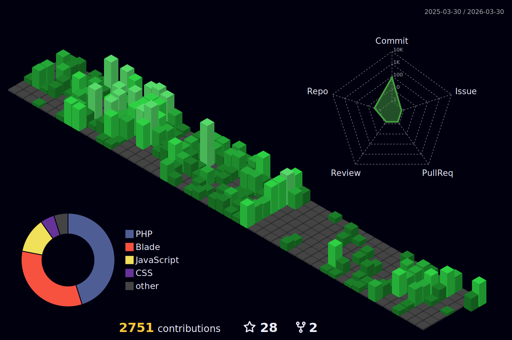

<!-- Header Image -->

<!-- Contribution Snake Animation -->
<picture>
  
</picture>

---

## 🚀 About Me

I'm **Abdallah Mahmoud**, a passionate full-stack developer with solid experience in building scalable web applications using a wide variety of technologies. I love clean code, robust architecture, and solving real-world problems through technology.

---

## 🛠️ Skills & Tools

  

---

## 🌐 Connect With Me

  
  
  
  
  
  
  
  
  
  
  
  

---

## 📈 GitHub Stats

  

